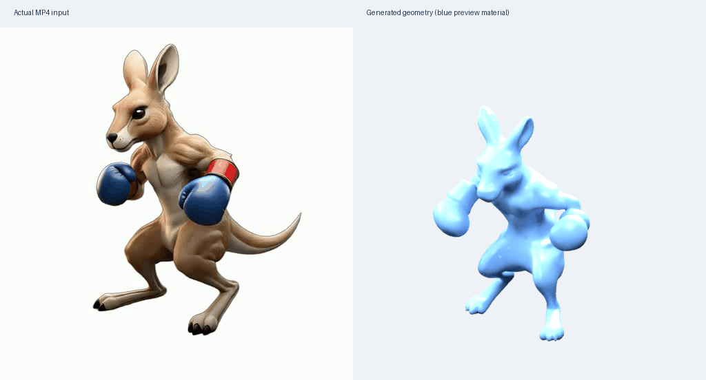

# 4D 研究复现

## Local Codex：从这里开始

当前源码交付入口是[原生上下文与连续接管交接](rounds/20261008-native-context/WEB_HANDOFF.md)。**GPU 保持停止；本次源码更新不恢复实验。** Local Codex 在精确交付 commit 先读[根级执行约束](AGENTS.md)与[项目运行手册](LOCAL_AGENT_RUNBOOK.md)，再按手册通过 `research-autopilot/scripts/run_harness.py` 驱动独立 Linux 主机；远端不需要 Codex/GPT，会话控制、Git、SSH 与文件回传由用户电脑承担。[既有基线交接](rounds/20261006-baseline-qualification/WEB_HANDOFF.md)保留为历史协议入口。

当前状态以 [CURRENT.json](docs/research-math-20261006/CURRENT.json) 和最新回执为准：r9 的九个工程基线单元已经完成，R3 原始归档保留了 311 项软件检查通过的记录，历史定价路径修复已在源码中。311 项回执不覆盖后续 macOS 路径修订和本轮新增代码。UID008 仅有紧凑评分一致性回传，完整 raw 包、重复评分和可信重放仍待补。候选完整验证设计与 native 结果仍为 0/15。

C13 规格要求的强简单对照现已有独立源码入口：`actionmesh/prepare_quadratic_acceleration_control.py` 通过现有单一 harness 按输入序列时间戳单位生成二阶差分、精确固定第 0 帧的二次加速度控制臂。它保留完整 16 帧、拓扑和顶点身份，输出清单可交给既有官方评分适配器。该交付是 **generated_unexecuted** 的对照，不是 C13 group-trend 候选本身，也不关闭 Natural Gate 0；先按运行手册完成当前 CPU 软件验收，再在精确保留的真实 `sequence.npz` 上执行其 CPU 计划。GPU 仍停止。

C13 group-trend 候选现在另有 `actionmesh/prepare_group_acceleration_candidate.py`：消费同一完整原生序列，按 supplied native loader clock 构造非均匀二阶差分，支持显式 hash 固定的非对角 temporal SPD metric（原生首个特化明确选择 identity），通过自由帧消元精确固定第 0 帧，并导出 3D group dual-ball、Fenchel 下界、primal/dual gap、ADMM residual 与完整原身份序列。源码和验收测试仍是 **generated_unexecuted**；尚未完成 Local 验收、真实五臂输入、官方评分、Natural Gate 0 或 IPCG。C13 现记为 **源码链完整、Local 未验证**，不是已验证候选或 native 结果；C14 也已完成源码链，其余 13 项仍有源码缺口，native 结果仍为 0/15。GPU 仍停止。

C13 五角色比较现在有独立的工程装配入口 `python -m research_math.c13_native_comparison request`。它只消费并重哈希已经保留的 B0、事前固定 B*、Gaussian、quadratic 与 group 报告/序列，核对同一 UID、seed、源字节、完整 16 帧拓扑与身份；B* 可显式别名到既有物理臂并只评分一次，准备失败仍留在五角色分母。当前缺少真实 B* 决策与科学准入，因此该入口固定输出 `dispatch_ready=false`，不运行官方评分，也不恢复 GPU。

C13 官方评分与原始收集现由 `research_math.c13_native_scoring` 和 `actionmesh/prepare_c13_native_scoring.py` 接续：前者把唯一物理臂逐字节暂存后一次调用固定 `official_actionbench_adapter.py`，核对官方六文件、CPU-kNN compatibility receipt、16 帧、GT/序列 hash、成功/失败分母，并把全部 raw 字节写成有上限、可重哈希的 `result.json`／`raw-manifest.json`／`raw-evidence.tar`。后者只在 C13 `design_verified`、完整确认性 native protocol、五角色方法身份/实现、严格环境锁、Natural Gate 0/IPCG、独立 family split、数值判据以及精确 UID/GPU 的一次性恢复授权均哈希匹配时生成单次零重试 harness 计划。当前真实准入文件和输入尚不存在，Web 未执行测试或评分，GPU STOP 仍有效；不得直接调用 `score` 绕过计划。

C14 不再以现有 body Gaussian 冒充候选：`actionmesh/prepare_corotational_residual_candidate.py` 现有独立的 **generated_unexecuted** CPU 计划。候选仅从完整预测网格对 frame zero 做 proper Kabsch，冻结 `R_t,c_t`，在共转 body residual 上求带第 0 帧锚定、按保留的 native loader-clock timesteps（当前为 0..15，非物理时钟）缩放的 XYZ-group TV，再用未改动的 pose 重建全部 16 帧、拓扑和顶点身份。`simple_mesh_controls.smooth_world/smooth_body` 仍是 world/body Gaussian 对照。C14 现已补齐独立五角色源码链：`research_math.c14_native_comparison` 事前固定 B0、B*、world Gaussian、body Gaussian 与 corotational residual，重算并核对 candidate certificate/body pose、当前实现字节和完整重建；`research_math.c14_native_scoring` 把任意字节相同角色归并为一次物理评分，绑定已准入 ActionBench 快照/语义/GT，核对 16 个 GLB 并输出有界可重哈希的三文件 raw 包；`actionmesh/prepare_c14_native_scoring.py` 仅在 design-verified、经已安装验证器通过的 Gate 0/IPCG、来源绑定 family split、协议一致数值判据、严格环境锁及精确请求的一次性限时 GPU 恢复授权齐备时生成零重试计划；唯一执行入口 `actionmesh/launch_c14_native_scoring.py` 在委托现有 harness 前验证最终消费/计划摘要并持有单所有者 claim。源码仍为 **generated_unexecuted**，Local 验收、科学准入和真实结果均未发生；源码链完整计数为 2/15、native 结果仍为 0/15，GPU STOP 不变。

本轮新增[完整原生 decoder capture 入口](docs/research-math-20261006/NATIVE_DECODER_CAPTURE.md)：`complete_unit_plan --capture-decoder` 可生成独立观测单元计划，接入官方生成、完整上下文归档和三臂评分。新增源码为 **generated_unexecuted**，需要 Local CPU harness 验收；GPU 实验保持停止，尚无完整原生 capture 或 replay 结果。新增观测单元不能沿用旧队列定价。

最新交付继续补齐独立成对生成验证、完整上下文回放、源时间查询和有限批次 supervisor。源码与验收测试已编写，仍须 Local 验收；supervisor 尚未安装或启动。共享接口不等于 15 个候选方法实现完成。环境与资产沿用[运行手册的固定数据/模型来源](LOCAL_AGENT_RUNBOOK.md#download-datasets-and-models)，优先复用仍匹配的已有资产。

成对原生上下文现在另有 `actionmesh/prepare_native_context_consumption.py`：它把成功回传的 `result.json`、`raw-manifest.json`、`raw-evidence.tar` 作为三个独立固定输入，由 harness 分别暂存；消费器再绑定生产 UID、GPU、generation identity、source-time 模式与冻结的 archive/metadata/解包上限，在复制前预检空间，并从私有快照逐成员重哈希、安全提取到新的单次 CPU harness 工作区。该消费层解决后续方法只能读取前一任务 live workspace 的问题；它仍是 **generated_unexecuted** 的传输/接口代码，不构成 native qualification、候选执行或 GPU 授权。

## 当前：方法必要性与可识别性审查

逐项交付状态见[15 项实现清单](docs/research-math-20261006/longgoal-20261007/CANDIDATE_INPUT_AUDIT.json)：包含数学依据、实际入口、输入接口、对照/消融、官方评分接入与缺口。C13 与 C14 现标记为“源码链完整、generated_unexecuted”；Local 验证与 native 结果仍为 0/15。成对原生上下文现在有独立的 `prepare_native_context.py` 计划入口和完整原始文件回传代码；仍待 Local 验收，GPU 保持停止。

[第二轮研究修订](docs/research-math-20261006/revisions/20261006-mechanism-boundaries/README.md)补推 C02 的保护代价和匹配步长对照、C20 的 principal-angle 可识别性及噪声放大、C05 的原生接口和 localized blend 离面边界。保留20个构造与原15个入选身份，更新全池顺序和15份条件规格。数学仍是条件自审，新候选实现、完整 native 实验及正式成败均为0。

新回传的 W0 checkpoint 已核对16个 pair／final receipt 字节 hash，分数与旧 summary 一致；小包仍缺其回执引用的352个阶段／raw成员。见[反馈审查](docs/research-math-20261006/revisions/20261006-mechanism-boundaries/w0-feedback-review.json)，完整 raw 导出与 native 回放继续待补。

## 2026-10-06：数学指标审查与最终证据回传

当前研究入口：[native-loss 修订与完整 20→15 排序](docs/research-math-20261006/revisions/20261006-native-loss/README.md)。C03 的平方风险收益不能保证原生非平方距离收益；已补精确反例、条件非平方标定推导和15份当前规格。`math_verified=20`、`selection_verified=true`；新候选 code/design/results_verified 仍为0。

[最终原始证据导出工具](scripts/research_evidence_20261006/README.md) 已通过34项文件/回执工程测试，可在原运行主机校验并打包final receipt的mesh/latents和逐臂scorer，保留旧快照与失败日志；这是证据工程，不是方法效果验证，原主机尚未执行此次导出。[下一窗口资格计划](docs/research-math-20261006/revisions/20261006-native-loss/QUALIFICATION.md) 写明强简单对照、完整原生预算和准入条件。

当前项目：**ActionMesh（CVPR 2026）官方预训练权重推理**，使用 RTX 2080 Ti 22 GiB，没有训练。

## 八小时实验反馈（2026-10-06）

[本轮复盘与下一轮设计](docs/research-overnight/FEEDBACK-20261006.md)：固定 16/16 个资产
在约 4 小时 2 分钟内完成，完整比较平均约 15 分钟。已记录实测成本与更强对照、
主任务/备用任务、最终回传核验要求；当前 runner 尚未接入新成本卡。
发布的 completion-verification 仍是早期 1/16 快照，原始回执的最终独立核验待补。

## 2026-10-05 的 8 小时单卡启动方案（历史）

[准备、启动、恢复和结果说明](docs/research-overnight/README.md)。默认复用已有
ActionMesh 环境，检查实际显存，按冻结顺序运行新的 ActionBench 样本和原生评分。
启动后最多 8 小时，重启沿用原截止时间。当前是基线和真实失败调查，尚未验证新方法。

```bash
git pull --ff-only
bash scripts/run_8h_2080ti.sh prepare
bash scripts/run_8h_2080ti.sh doctor
# 晚上 23:00 在 GPU 服务器运行：
nohup bash scripts/run_8h_2080ti.sh run --hours 8 > overnight-console.log 2>&1 &
```

## 研究结果总览（2026-10-03）

[全部十批实验结果](results/README.md) · [十项方法与71项测试](results/ten-methods-20261003/README.md) · [自然样本基线与负面结果](results/census-20261002/README.md) · [原始大归档下载](https://github.com/Yunbo-max/4d/releases/tag/results-2026-10-03)

本机和远端十项候选的代码测试均为71项通过、零跳过；这不等于十项方法已在自然数据上改善质量。全部实验结论、构造测试与真实GPU检查范围见对应报告。

## 四种应用实测

2026-10-02 已补上外部 Wan 视频生成模型，完成文字、图片 + 文字、3D + 文字三个端到端样例。视频应用沿用此前验证的袋鼠基线。此前“视频加载器拒绝文字/单图”的结果只说明入口用错，不能判定项目不支持这些应用。

| 应用 | 实测样例 | 结果 | 前置视频 / ActionMesh 显存峰值 |
|---|---|---|---:|
| 视频 → 4D | 官方袋鼠视频 | 已验证16帧动态网格 | 不适用 / 10,257 MiB |
| 文字 → 4D | 章鱼演奏沙锤 | 已生成16帧动画；局部断连、漂浮，沙锤不准确 | 10,347 / 10,257 MiB |
| 图片 + 文字 → 4D | 蘑菇图片 + 唱歌剧 | 已生成16帧动画；无纹理，有嘴部及肢体动作 | 13,201 / 10,255 MiB |
| 3D + 文字 → 4D | 熊猫GLB + 悠闲行走 | 已生成16帧动画，保留原拓扑和纹理像素 | 13,201 / 10,255 MiB |

已采样的视频生成和ActionMesh阶段最大值为 **13,201 MiB（12.89 GiB）**；单图静态重建另记录PyTorch显存，详见[静态阶段报告](results/applications-20261002/image-mushroom/static-anchor/report.json)。只对应512×512、33帧、50步的前置视频配置和ActionMesh低显存配置，不能推广到默认720p或更长视频。技术流程已通，画面质量仍有局限，并非完整论文benchmark或官网同配置复刻。

| 视频：袋鼠 | 3D + 文字：熊猫 | 图片 + 文字：蘑菇 | 文字：章鱼 |
|---|---|---|---|
|  |  |  |  |

[完整结果、实际提示词、时间/显存、复现命令与效果限制](results/applications-20261002/README.md)

- [视频→4D：袋鼠动画 GLB](results/input-modes/kangaroo-video/animated_mesh.glb)
- [章鱼动画 GLB](results/applications-20261002/text-octopus/animated_mesh.glb)
- [蘑菇动画 GLB](results/applications-20261002/image-mushroom/animated_mesh.glb)
- [熊猫带纹理动画 GLB](results/applications-20261002/mesh-panda/animated_mesh.glb)
- [接入前的根因诊断](results/input-modes/application-debug-20261002.md)

前置采用`Wan-AI/Wan2.2-TI2V-5B-Diffusers`，不是已确认的作者演示模型版本。文字走论文允许的文字→视频→4D路线；另外两例用模型正面渲染和动作文字生成视频，再将视频与网格输入ActionMesh。

## 已有视频格式基线（2026-10-01）

| 视频输入格式 | 官方入口耗时 | 峰值显存 |
|---|---:|---:|
| PNG连续帧（袋鼠） | 649.33 s | 10,255 MiB |
| MP4（袋鼠） | 666.03 s | 10,257 MiB |
| MP4 + GLB（熊猫） | 615.98 s | 10,255 MiB |

均为16帧、FP16、`--low_ram`、seed42、官方默认100/30步，未启用`--fast`。见[视频输入格式实测](results/input-modes/README.md)及[最初袋鼠结果](results/kangaroo/preview.gif)。

## 目录

- `actionmesh/repo/`：固定官方代码与TripoSG，保留原许可证。
- `actionmesh/weights-manifest.json`、`download_weights.py`：ActionMesh相关权重及国内镜像下载校验。
- `actionmesh/video-weights-manifest.json`、`download_video_weights.py`、`verify_video_weights.py`：前置Wan权重及FP16派生审计。
- `actionmesh/prepare_application_anchor.py`、`render_application_mesh.py`：单图三维重建与正面渲染。
- `actionmesh/run_application_case.py`：固定三例的视频、ActionMesh与导出入口。
- `actionmesh/render_animation_check.py`：实际GLB重新导入、动画和材质检查。
- `results/applications-20261002/`：新结果、原始输入、中间视频、逐帧网格、日志与验收记录。

## Linux GPU 环境

需要 Python ≥3.10、可用的 CUDA PyTorch/torchvision，以及 `aria2c`。
本次使用独立 venv 复用服务器已有的 torch 2.12.1+cu130、torchvision 0.27.1+cu130。

```bash
cd actionmesh
python -m venv --system-site-packages inference-env
inference-env/bin/pip install -i https://pypi.tuna.tsinghua.edu.cn/simple -r requirements-inference.txt
inference-env/bin/pip install --no-build-isolation --no-deps -e repo
python download_weights.py
inference-env/bin/python finish_inference.py --verify-only
inference-env/bin/python finish_inference.py --run
```

`--run` 前必须确认显卡空闲。默认保存 16 帧 GLB 网格、变形数组和 `runtime.json`；单文件动画 GLB 导出另需 Blender。
显存占用以实际测量为准。这里没有训练流程。

## 同步到电脑

```bash
cd /Users/yunbo/Documents/4d
git pull --ff-only
```

模型权重通过脚本单独下载，不随 Git 同步。已生成且上传的结果会随 Git 更新。

## 来源与许可证

- [ActionMesh 官方仓库](https://github.com/facebookresearch/actionmesh)，版本 `d5c01f5045df55819e337369c9617f603c667e00`。
- [TripoSG 官方仓库](https://github.com/VAST-AI-Research/TripoSG)，版本 `fc5c40990181e2a756c4e0b1c2f4d6b5202faf8c`。
- 两个项目的原始 LICENSE 均保留在对应目录。上游代码归原作者所有；本仓库整理复现流程及实际运行记录。

## 旧袋鼠基线的导出

以下`export_result.py`仅用于旧袋鼠基线；新应用请使用`run_application_case.py --stage export`，以保留各自输入和原始纹理。

完成袋鼠推理后，可以使用 Blender 3.5.1 导出单文件动画和预览：

```bash
cd actionmesh
inference-env/bin/python export_result.py outputs/<运行目录> --blender /path/to/blender
```

导出包括 `animated_mesh.glb`、`preview.gif`、`deformations.npz` 和 `per-frame-meshes.zip`。
预览左侧为官方输入，右侧为生成网格，使用统一蓝色材质和固定灯光。
如果 Blender 缺少本地动态库，可以用 `--library-dir` 指定单独准备的库目录。
