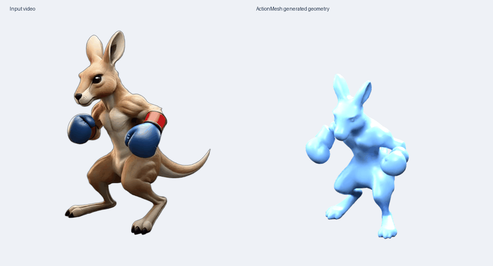

# 4D 研究复现

当前项目：**ActionMesh（CVPR 2026）官方预训练权重推理**。

## 状态

- 官方代码与依赖已在 RTX 2080 Ti 22GB 上完成导入检查。
- 官方 kangaroo 示例包含 16 帧 512×512 RGBA 图像。
- **官方袋鼠示例推理已完成**：16 帧动态网格，约 10 分 49 秒，采样显存峰值 10,255 MiB（约 10.0 GiB）。
- 每帧 19,999 个顶点、39,994 个三角面，拓扑一致、数据有效，并检测到运动。
- 本次记录对应一个官方示例；完整 benchmark 尚未运行。
- 使用 FP16、`--low_ram`、seed=42，保留官方默认推理步数。

## 生成结果



左侧为官方输入视频；右侧是本次生成的三维网格，使用蓝色预览材质。

- [动画 GLB](results/kangaroo/animated_mesh.glb)
- [逐帧网格压缩包](results/kangaroo/per-frame-meshes.zip)
- [变形数组](results/kangaroo/deformations.npz)
- [运行报告](results/kangaroo/report.json)与[显存采样](results/kangaroo/gpu-memory.csv)

## 目录

- `actionmesh/repo/`：官方代码及示例，保留原许可证。
- `actionmesh/repo/third_party/TripoSG/`：对应固定版本的 TripoSG。
- `actionmesh/weights-manifest.json`：固定模型版本、文件大小、官方 SHA256、哈希一致的国内镜像地址。
- `actionmesh/download_weights.py`：生成断点续传下载清单并下载、校验。
- `actionmesh/finish_inference.py`：校验权重、运行官方示例、检查输出并记录显存。
- `results/`：运行记录与后续生成结果。

## Linux GPU 环境

需要 Python ≥3.10、可用的 CUDA PyTorch/torchvision，以及 `aria2c`。
本次使用独立 venv 复用服务器已有的 torch 2.12.1+cu130、torchvision 0.27.1+cu130。

```bash
cd actionmesh
python -m venv --system-site-packages inference-env
inference-env/bin/pip install -i https://pypi.tuna.tsinghua.edu.cn/simple -r requirements-inference.txt
inference-env/bin/pip install --no-build-isolation --no-deps -e repo
python download_weights.py
inference-env/bin/python finish_inference.py --verify-only
inference-env/bin/python finish_inference.py --run
```

`--run` 前必须确认显卡空闲。默认保存 16 帧 GLB 网格、变形数组和 `runtime.json`；单文件动画 GLB 导出另需 Blender。
显存占用以实际测量为准。这里没有训练流程。

## 同步到电脑

```bash
cd /Users/yunbo/Documents/Codex/4d
git pull --ff-only
```

模型权重通过脚本单独下载，不随 Git 同步。已生成且上传的结果会随 Git 更新。

## 来源与许可证

- [ActionMesh 官方仓库](https://github.com/facebookresearch/actionmesh)，版本 `d5c01f5045df55819e337369c9617f603c667e00`。
- [TripoSG 官方仓库](https://github.com/VAST-AI-Research/TripoSG)，版本 `fc5c40990181e2a756c4e0b1c2f4d6b5202faf8c`。
- 两个项目的原始 LICENSE 均保留在对应目录。上游代码归原作者所有；本仓库整理复现流程及实际运行记录。

## 导出动画和预览

完成一次推理后，可以使用 Blender 3.5.1 导出单文件动画和预览：

```bash
cd actionmesh
inference-env/bin/python export_result.py outputs/<运行目录> --blender /path/to/blender
```

导出包括 `animated_mesh.glb`、`preview.gif`、`deformations.npz` 和 `per-frame-meshes.zip`。
预览左侧为官方输入，右侧为生成网格，使用统一蓝色材质和固定灯光。
如果 Blender 缺少本地动态库，可以用 `--library-dir` 指定单独准备的库目录。
